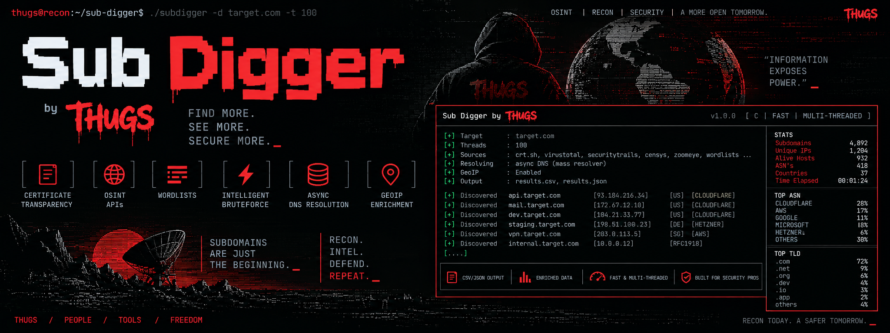

<p align="center">
  
</p>

<h1 align="center">SubDigger</h1>

<p align="center">
  <em>High-performance, multi-threaded subdomain discovery for recon, OSINT and security testing.</em>
</p>

<p align="center">
  
  
  
  
  
</p>

---

Point it at a domain and it works every angle at once: certificate transparency
logs, wordlists, OSINT APIs, bruteforce permutation, DNS zone transfers, and
recursive discovery off of every CNAME, NS and PTR record it finds along the
way. Every hit gets enriched — A/AAAA/CNAME chains, NS, MX, TXT, CAA, PTR,
GeoIP, ASN, TLD intelligence — and flagged for subdomain takeover risk, all
streamed to CSV or JSON in real time across up to 1400 threads.

## What's in the box

| | |
|---|---|
| **Discovery** | Certificate Transparency (crt.sh) · Wordlists (14 bundled) · Bruteforce (depth 1–5) · DNS Zone Transfer (AXFR) · Recursive (CNAME/NS/PTR follow-up) · Wildcard DNS detection |
| **OSINT APIs** | 19 sources — BeVigil, BinaryEdge, BufferOver (free, no key), C99, Censys, CertSpotter, Chaos, FullHunt, GitHub, Hunter, IntelX, LeakIX, Netlas, PassiveTotal, SecurityTrails, Shodan, VirusTotal, WhoisXMLAPI, ZoomEye |
| **Enrichment** | A, AAAA, CNAME (chain following), NS, MX, TXT, CAA, PTR · dangling DNS / takeover detection · IANA TLD data · MaxMind GeoLite2 country, city, ASN |
| **Performance** | 140 threads by default (20 per DNS server), up to 1400 · async DNS via c-ares · per-server health monitoring with automatic failover · real-time streaming output |
| **Output** | CSV or JSON, streamed as results arrive · file-based cache with automatic deduplication |
| **Security** | RFC 1035 domain validation · input sanitization · path traversal prevention · config file permission checks · stack protection |

## Install

> **💡 Performance tip:** set up your own DNS resolver for ~10x faster scans — see [UNBOUND.md](UNBOUND.md) for a 5-minute setup.

```bash
# Dependencies
apt-get install -y build-essential libc-ares-dev libcurl4-openssl-dev \
                   libjson-c-dev libmaxminddb-dev ruby-ronn

# Build & install
make
sudo make install

# ...or build a Debian package
make deb
sudo dpkg -i ../subdigger_1.4.1-1_amd64.deb
```

Then install a GeoIP database for country/city/ASN resolution:

```bash
apt-get install geoipupdate
# configure /etc/GeoIP.conf with your MaxMind account
geoipupdate
```

## Usage

```bash
# Basic scan
subdigger -d example.com

# JSON output, streamed to file
subdigger -d example.com -f json -o results.json

# Wordlist + cert transparency + bruteforce, depth 4
subdigger -d example.com -m wordlist,cert,bruteforce --bruteforce-depth 4

# Custom wordlist (disables auto-discovery)
subdigger -d example.com -w /path/to/custom-wordlist.txt

# Quiet mode, piped into another tool
subdigger -d example.com -q | grep -i admin

# Everything, high thread count
subdigger -d example.com -m wordlist,cert,bruteforce,dns,api -t 280
```

## Configuration

Lives at `~/.subdigger/config`:

```ini
[general]
# threads = 140  # Auto: 20 per DNS server (default)
timeout = 2

[dns]
servers = 8.8.8.8,8.8.4.4,1.1.1.1,1.0.0.1,208.67.222.222,208.67.220.220,9.9.9.9

[discovery]
methods = wordlist,cert
wordlist_path = ~/.subdigger/wordlists/common-subdomains.txt
auto_wordlists = true
bruteforce_depth = 3

[output]
format = csv

[cache]
enabled = true

[apis]
# Passive subdomain discovery API keys
# Free tier available: BufferOver (no key required)
bevigil_key =
binaryedge_key =
c99_key =
censys_id =
censys_secret =
certspotter_key =
chaos_key =
fullhunt_key =
github_token =
hunter_key =
intelx_key =
leakix_key =
netlas_key =
passivetotal_user =
passivetotal_key =
securitytrails_key =
shodan_key =
virustotal_key =
whoisxmlapi_key =
zoomeye_key =
```

## Discovery methods

- **wordlist** — enumerate using bundled or custom wordlist files
- **cert** — query certificate transparency logs via crt.sh
- **bruteforce** — generate and test subdomain permutations (a-z, 0-9, `_`, depth 1-5)
- **dns** — attempt DNS zone transfer (AXFR)
- **api** — query the 19 supported OSINT APIs (most need a key, see below)
- **recursive** — auto-discover further subdomains from CNAME, NS and ReverseDNS targets

## API services

Configure keys under `[apis]` in `~/.subdigger/config`, then run with `-m api`.

**No key required:** BufferOver (free passive DNS replication).

| Service | Get a key | Notes |
|---|---|---|
| BeVigil | https://bevigil.com/osint-api | Mobile app security platform |
| BinaryEdge | https://www.binaryedge.io/ | Internet scanning platform |
| C99.nl | https://api.c99.nl/ | Multi-purpose API service |
| Censys | https://search.censys.io/api | Needs both `censys_id` and `censys_secret` |
| CertSpotter | https://sslmate.com/certspotter/api/ | Certificate transparency monitoring |
| Chaos | https://chaos.projectdiscovery.io/ | ProjectDiscovery's subdomain dataset |
| FullHunt | https://fullhunt.io/ | Attack surface management |
| GitHub | https://github.com/settings/tokens | Code search for subdomains |
| Hunter | https://hunter.io/api | Email and domain intelligence |
| IntelX | https://intelx.io/ | Intelligence data search engine |
| LeakIX | https://leakix.net/ | Internet-wide asset discovery |
| Netlas | https://netlas.io/ | Internet assets search |
| PassiveTotal | https://community.riskiq.com/ | Needs both `passivetotal_user` and `passivetotal_key` |
| SecurityTrails | https://securitytrails.com/ | DNS and domain intelligence |
| Shodan | https://account.shodan.io/ | Internet device search engine |
| VirusTotal | https://www.virustotal.com/gui/my-apikey | URL and file analysis |
| WhoisXMLAPI | https://whoisxmlapi.com/ | Domain and IP intelligence |
| ZoomEye | https://www.zoomeye.org/ | Cyberspace search engine |

```bash
subdigger -d example.com -m api               # all configured APIs
subdigger -d example.com -m wordlist,cert,api  # combined with other methods
```

## Output formats

<details>
<summary><strong>CSV</strong> (default)</summary>

```csv
Date,Domain,Subdomain,A,AAAA,ReverseDNS,CNAME,CNAME-IP,NS,MX,CAA,TXT,Dangling,TLD,TLD-ISO,TLD-Country,TLD-Type,TLD-Manager,IP-ISO,IP-Country,IP-City,ASN-Org,Source
2026-02-05T14:23:45Z,example.com,www.example.com,93.184.216.34,,,,,ns1.example.com,,,false,false,com,US,United States,generic,IANA,US,United States,Los Angeles,Example AS,wordlist:common
```
</details>

<details>
<summary><strong>JSON</strong></summary>

```json
{
  "subdomains": [
    {
      "timestamp": "2026-02-05T14:23:45Z",
      "domain": "example.com",
      "subdomain": "www.example.com",
      "a_record": "93.184.216.34",
      "aaaa_record": "",
      "reverse_dns": "",
      "cname_record": "",
      "cname_ip": "",
      "ns_record": "ns1.example.com",
      "mx_record": "",
      "caa": false,
      "txt": false,
      "dangling": false,
      "tld": "com",
      "tld_iso": "US",
      "tld_country": "United States",
      "tld_type": "generic",
      "tld_manager": "IANA",
      "ip_iso": "US",
      "ip_country": "United States",
      "ip_city": "Los Angeles",
      "asn_org": "Example AS",
      "source": "wordlist:common"
    }
  ]
}
```
</details>

## Performance

- 140 threads by default (20 per DNS server across 7 servers), up to 1400 max
- Real-time streaming output — no waiting for the scan to finish
- Asynchronous DNS resolution with c-ares (per-thread DNS channels)
- Thread-safe task queue and result buffer with mutex protection
- Automatic deduplication and result caching
- Per-DNS-server health monitoring with automatic failover
- 3-second timeout protection with thread respawning

### ⚡ Run your own DNS resolver

Public DNS (8.8.8.8) tops out around ~130 queries/second under rate limiting.
A local Unbound resolver does ~1200+ queries/second with no limits — zero
network latency, direct queries to authoritative nameservers, full thread
utilization. A 350k-subdomain scan drops from 45-60 minutes to **5-8 minutes**.

```bash
sudo apt-get install unbound
echo "servers = 127.0.0.1" >> ~/.subdigger/config
```

Full setup guide: [UNBOUND.md](UNBOUND.md).

## Security

- RFC 1035 domain validation
- Input sanitization (alphanumeric + dots + hyphens)
- Path traversal prevention
- Configuration file permission checks
- Stack protection and buffer overflow defenses
- No global mutable state without synchronization

## Dependencies

- `libc-ares2` — asynchronous DNS resolution
- `libcurl4` — HTTP client for API queries
- `libjson-c5` — JSON parsing
- `libmaxminddb0` — GeoIP database lookups
- `geoipupdate` — GeoIP database updater (recommended)

## Docs

[Implementation](IMPLEMENTATION.md) ·
[Unbound setup](UNBOUND.md) ·
[Verification](VERIFICATION.md)

## Contributing

Contributions are welcome — open an issue or a pull request.

## License

MIT — see [LICENSE](LICENSE).

## Author

Developed by Kawaiipantsu (thugsred@protonmail.com) for security research and penetration testing.

<p align="center"><sub><a href="https://github.com/kawaiipantsu/subdigger">github.com/kawaiipantsu/subdigger</a></sub></p>
